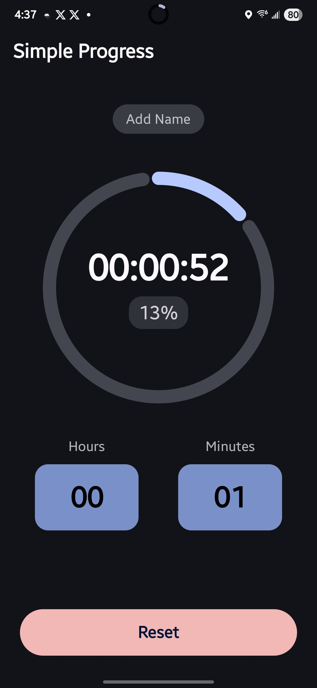

# Simple Progress

A minimal, distraction-free countdown timer for Android that keeps you informed with a glance—right from your notification shade.

<a href="https://play.google.com/store/apps/details?id=com.tk.simpleprogress">
  
</a>

## Motivation

>I wanted a countdown timer that shows a progress bar in the notification panel and doesn't make any sound when it finishes.  I should be able to tell how much time is left just with a quick glance. 
>
>Example use cases:
> - When you're on a flight, If you start the timer after takeoff, you can track the flight progress. Some flights show this on a screen, but not all of them do.
> - When you watch a movie in a theater, you can set the movie's duration and start the timer when it begins. The progress bar in your notifications will show how much of the movie is left.
>

## Features

• **Persistent notification with progress bar** – see the remaining time and percentage at a glance, with a reset button for quick timer control.

• **No sounds, no alarms** – the timer ends silently with a single "done" notification so it never interrupts a movie, a flight, or your focus.

• **Flexible countdown options** – set timers based on duration (hours/minutes) or specific end time for precise scheduling.

• **Timer scheduling** – schedule timers to start automatically at a specific time (up to 24 hours in advance). Perfect for planning ahead—set a timer for your movie start time or flight departure, and it will begin automatically.

• **Label your timers** – optionally name each countdown (e.g. "Flight to JFK" or "Barbie movie").

• **Edge-to-edge Compose UI** – built entirely with Kotlin and Jetpack Compose.

• **State restoration** – progress is preserved across configuration changes and app restarts.

## Screenshots

| Home screen | In-app progress | Notification progress |
|-------------|-----------------|-----------------------|
|  |  |  |

## Getting Started

### Requirements

• Android Studio Iguana (or newer)

• Android SDK 35 (compile & target)

• Minimum Android 7.0 (API 24)

### Build & Run

1. Clone the repository:
   ```bash
   git clone https://github.com/your-username/simple-progress.git
   cd simple-progress
   ```
2. Open the project in Android Studio _or_ build via command line:
   ```bash
   ./gradlew :app:installDebug
   ```
3. Deploy the `simple-progress` APK to a connected device or emulator running API 24+.

## Usage

### Starting a Timer Immediately

1. Enter the desired hours and/or minutes.
2. Tap **Start** and (optionally) name your timer.
3. Minimize the app—the ongoing notification shows a determinate progress bar and the remaining time.
4. When finished, a silent "Timer is done!" notification appears.

### Scheduling a Timer

1. Enter the desired hours and/or minutes for the timer duration.
2. Tap **Schedule** to open the time picker.
3. Select the time when you want the timer to start (must be within 24 hours).
4. Optionally name your scheduled timer.
5. The timer will automatically start at the scheduled time, even if the app is closed.
6. View or cancel your scheduled timer from the scheduled timers list.

## Architecture

The app follows MVVM architecture with Jetpack Compose:

• **UI Layer**: Compose components in `components/` package with Material 3 theming
• **ViewModel Layer**: `TimerViewModel` manages timer state using StateFlow and Coroutines
• **Data Layer**: `TimerActionBus` handles timer events and `TimerResetReceiver` manages system interactions
• **Utils**: `TimeUtils` provides time formatting and calculation utilities

The core timer logic leverages Kotlin Coroutines for background processing and StateFlow for reactive UI updates. The notification system uses a low-importance channel to display persistent progress without interrupting the user experience.

## License

This project is licensed under the MIT License—see the [LICENSE](LICENSE) file for details. 
