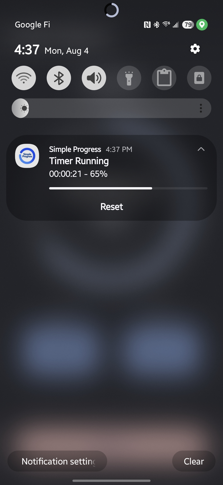

# Simple Progress

A minimal, distraction-free countdown timer for Android that keeps you informed with a glance—right from your notification shade.

## Motivation

>I wanted a countdown timer that shows a progress bar in the notification panel and doesn't make any sound when it finishes.  I should be able to tell how much time is left just with a quick glance. 
>
>Example use cases:
> - When you're on a flight, If you start the timer after takeoff, you can track the flight progress. Some flights show this on a screen, but not all of them do.
> - When you watch a movie in a theater, you can set the movie's duration and start the timer when it begins. The progress bar in your notifications will show how much of the movie is left.
>

## Features

• **Persistent notification with progress bar** – see the remaining time and percentage at a glance.

• **No sounds, no alarms** – the timer ends silently with a single "done" notification so it never interrupts a movie, a flight, or your focus.

• **Label your timers** – optionally name each countdown (e.g. "Flight to JFK" or "Barbie movie").

• **Edge-to-edge Compose UI** – built entirely with Kotlin and Jetpack Compose.

• **State restoration** – progress is preserved across configuration changes and app restarts.

## Getting Started

### Requirements

• Android Studio Iguana (or newer)

• Android SDK 35 (compile & target)

• Minimum Android 7.0 (API 24)

### Build & Run

1. Clone the repository:
   ```bash
   git clone https://github.com/your-username/simple-progress.git
   cd simple-progress
   ```
2. Open the project in Android Studio _or_ build via command line:
   ```bash
   ./gradlew :app:installDebug
   ```
3. Deploy the `simple-progress` APK to a connected device or emulator running API 24+.

## Usage

1. Enter the desired hours and/or minutes.
2. Tap **Start** and (optionally) name your timer.
3. Minimize the app—the ongoing notification shows a determinate progress bar and the remaining time.
4. When finished, a silent "Timer is done!" notification appears.

## Screenshots

| Notification progress | In-app progress | Home screen |
|-----------------------|-----------------|-------------|
|  |  |  |

## Architecture

The core logic lives in `TimerViewModel`, leveraging Kotlin Coroutines and `StateFlow` to drive both the Compose UI and a low-importance notification channel. All UI components are written in Jetpack Compose, Material 3.

## Contributing

Pull requests are welcome! If you have ideas for improvement—vibration patterns, preset durations, Wear OS support—feel free to open an issue first to discuss.

## License

This project is licensed under the MIT License—see the [LICENSE](LICENSE) file for details. 
